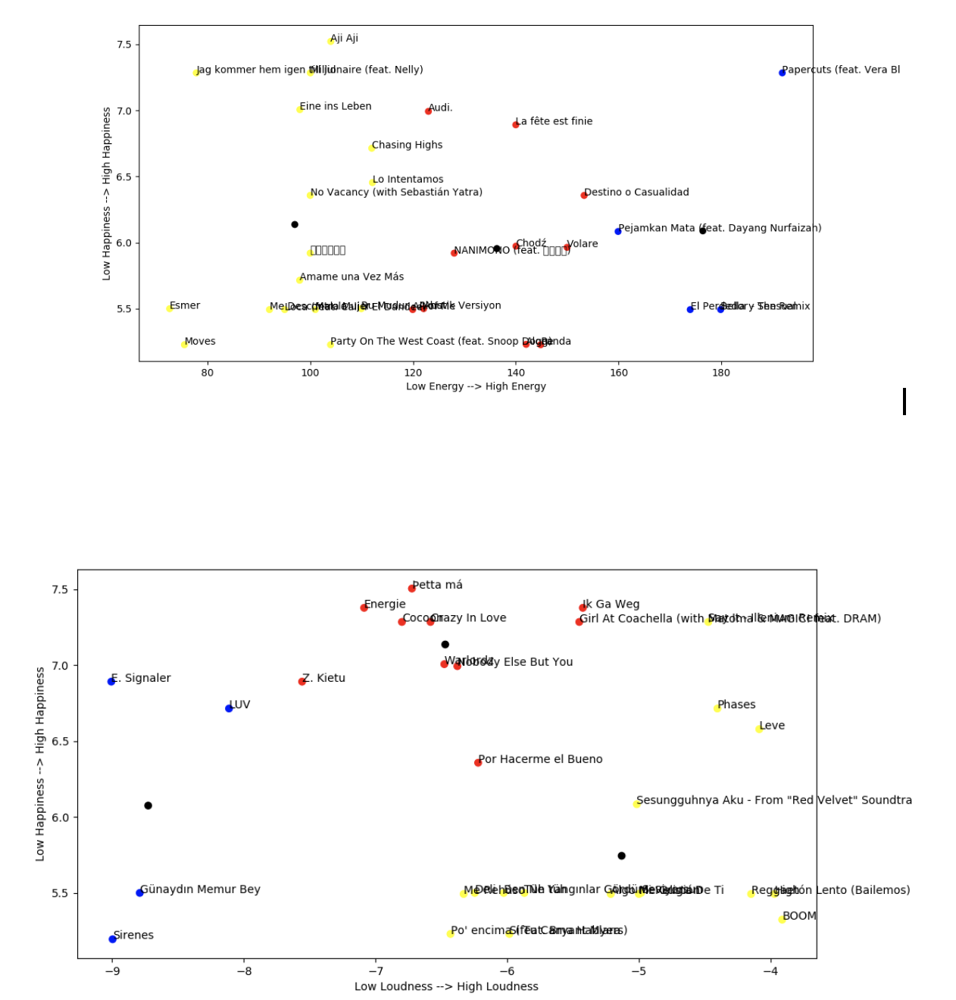
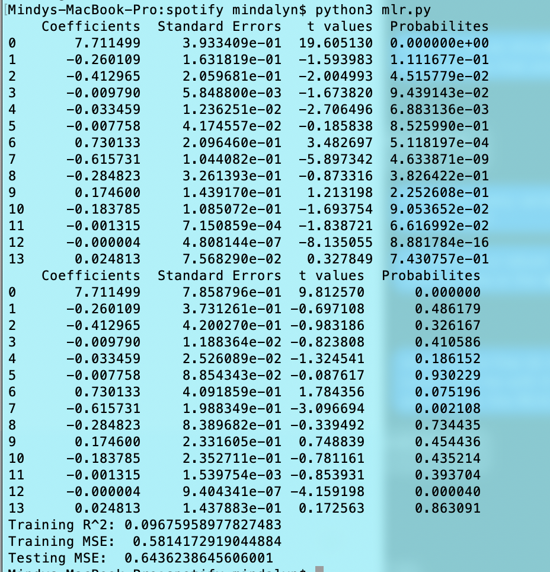

# Happy Hits | Turn Up Tunes | Juicy Jams

## Blog Post 1

What song features predict happiness of a country? What song features are more popular/are liked the most by the happiest countries?

In this project, we plan to merge data on happiness by country and top Spotify songs per country from 2017 in order to answer these questions. So far, we've worked on merging the data based on country code. We plan to use a random sample of about 25 of the top 200 songs from a select number of countries, in order to cut down on some of the data. We will implement a supervised learning algorithm for our predictions and find correlations between happier countries and higher values of certain song features. We may use this data to do a sentiment analysis of top songs by region and measure how consistent it is with our happiness data. We eventually plan to present this data in a map-like visualization.

Raw:

data.db- In this file, we have the database of every region's 200 top songs for every day for the year 2017. We plan to add information regarding the audio features of each song to this database by using Spotify's API. We found the data at https://www.kaggle.com/edumucelli/spotifys-worldwide-daily-song-ranking/version/3. 

world_happiness_report.csv- In this file, we have the happiness rankings of 155 countries. We found the data at https://www.kaggle.com/unsdsn/world-happiness. 

country_codes.csv = In this file, we have country names along with their country codes. We found the data at https://datahub.io/core/country-list#resource-country-list_zip

## Blog Post 2

We started off by trying to do a k-means clustering on 20 random songs that have two features-- a feature of the song(energy, loudness, etc.) and the happiness score of the country where that song was the top daily song. One initial hypothesis we were working with was that higher energy and louder songs would correlate with lower happiness countries as they would use energetic music as an outlet//escape. We ended up not finding any strong correlations, as you can see in the visualizations below. 

Next, we tried a multiple linear regression analysis instead. We looked at the features with the lowest p values and highest coefficients, and we played around with analyzing different combinations of features. We mostly found that no feature's presence or absence altered our results//helped us better predict happiness as much as speechiness' did. See results below.

Challenges that we're facing and how we're moving forward:
  1) So far, the hardest part of the project has been handling very large datasets. One dataset that we are using has 53 countries top 200 daily songs for everyday of the year 2017-- that’s more than 2 million rows. We then had to merge that with the features we found for those songs using the Spotify API. Deciding how many of the data points we actually want to use has been an ongoing struggle. For example, we had trouble deciding whether we should choose top songs randomly or pick the top 10 daily songs rather than 200. Also, when we tried to visualize the data, there were way too many datapoints, so we have to decide new ways of visualizing this data in meaningful ways. 
   2) Spotify is not available in a lot of the countries with the lowest happiness scores, therefore we don't have a lot of the data on the least happy countries' top songs. We had to take data from the countries that have lowest scores OUT of the countries that Spotify does have data on. This means that the differences in scores between the top happy and lowest happy countries are not as large as we would have wanted.
   3) We have been concerned about but have not yet had to tackle directly is whether or not we will actually be able to make a sound conclusion. Social science research tends to have a low R-squared value, meaning that the model does not explain much of the variability in the data. Happiness is not a measurable thing, so finding a way to interpret the data in a meaningful way when there are many other variables that impact the output seems like it will be a daunting task. 

## Final Blog Post:
### Vision: 
What song features predict happiness of a country? What song features are more popular/are liked the most by the happiest countries? By using data from 2017 on the happiness of countries, the top Spotify songs for these countries, and their audio features we conducted learning algorithms to find correlations between country happiness and song audio features.

In our exploration, we found that speechiness is the most significant feature that predicts happiness in a country. Speechiness is measured on a continous scale from 0-1, and we found that .1 more unit of speechiness in a song predicts that it is ~17 times more likely to be from a country with a higher happiness score.

### Data: 
What data did you use? 
  We merged 3 datasets:
  
  - World Happiness Report 2017: Calculates a happiness score for 155 countries based on a variety of features including GDP per capita, life expectancy, trust in government, etc.

  - Top Spotify Songs 2017: top 200 songs per country per day

  - Spotify Audio Features: each song has 13 features: 
      -energy   -danceability   -acousticness   -key   -loudness
      -speechiness (presence of spoken word)  -instrumentalness
      -valence  tempo -liveness (presence of audience)  -duration
    These features were measured by the Spotify API itself, and for the most part ranged from 0 to 1.

Relative to its size was there enough information contained within it? 
- Although there are around 195 countries, The World Happiness report only had data on 155 of them. This wasn't an issue however, because we happened to be more limited by the lack of countries that Spotify had data for. Top songs had 200 top songs per day per country which meant that there were over 2 million rows in the table. This was too much data, which was going to affect our p value in an artifical way, so we parsed that down. Even with this huge amount of data, it didn't completely have everything we needed. Spotify is not available in a lot of the countries with the lowest happiness scores, therefore we don't have a lot of the data on the least happy countries' top songs.

Were you able to find what you wanted in the data? How did you collect, clean, and integrate it?
- We found two of the datasets (Top songs and world happiness report) on Kaggle, where it had already been cleaned. After parsing down the top spotify songs data set (so that there were no repeat songs), and so that we only looked at every 5th song (because the set was too big), we merged this with the happiness table based on country code/region. In every row of this table, we had a song and data relevant to the country that it appeared in a top chart for. Then we gathered the audio features for each song from the Spotify API and added them to the table.
  
### Methodology: 
What did you do with your data? 
- Now that we had our data collected, we wanted to see if we could point out the features of songs that made a difference.
What techniques were used to pick apart the data? Did you use ML? Stats? 
- We originally tried KNN and Multiple Linear Regression (refer to Blog Post 2). As a final step, we tried logistic regression using data from the top 10 happiest country and the bottom 10 least happy countries. 

How did you visualize your data?

